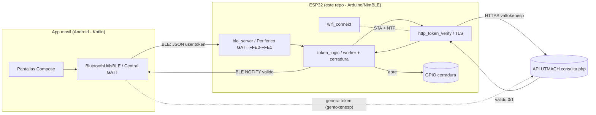
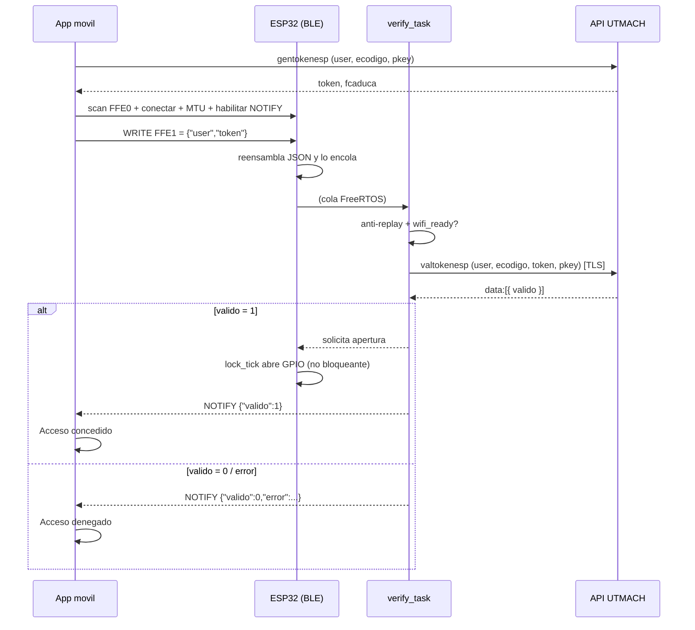

# SISCA · Firmware ESP32 (control de cerradura por BLE)

Firmware para **ESP32** que actúa como cerradura inteligente del sistema **SISCA**. Expone un
periférico **Bluetooth Low Energy (BLE/GATT)**; la [app móvil SISCA](https://github.com/jossuema/sisca-mobile)
se conecta, le envía un token de acceso, el firmware lo **verifica contra la API de la UTMACH** y,
si es válido, **abre la cerradura** (activa un GPIO) y responde el resultado a la app.

> Migrado de Bluetooth Classic (SPP) a **BLE (NimBLE)** para interoperar con la app móvil (que es un
> central BLE) y poder usarse en cualquier variante de ESP32.

---

## 1. Arquitectura del sistema

SISCA está formado por **dos repositorios** que se comunican por BLE:



- **App móvil** (`sisca-mobile`): el usuario inicia sesión, elige el aula y se autentica (rostro /
  huella). La app **genera** un token con la API (`gentokenesp`) y lo envía al ESP por BLE.
- **Firmware ESP32** (este repo): **verifica** el token con la API (`valtokenesp`) y abre la cerradura.

La autorización real es **server-side**: la cerradura solo abre si la API responde `valido:1`.

---

## 2. Cómo funciona (flujo de apertura)



Puntos de diseño clave:

- **No bloqueante.** El `loop()` solo hace trabajo rápido (vigilado por el watchdog). La verificación
  HTTP (lenta) corre en una **tarea worker** aparte; un servidor lento **no reinicia** el equipo.
- **Cerradura por tiempo sin `delay`.** `lock_tick()` abre y cierra el GPIO con una marca de tiempo.
- **WiFi no bloqueante con reconexión** + **NTP** (la validación del certificado TLS necesita la hora).
- **Anti-replay** local: rechaza el mismo token reenviado dentro de `REPLAY_WINDOW_MS` (defensa en
  profundidad; la protección principal es la caducidad/uso único del token en el backend).

---

## 3. Estructura del firmware

| Archivo | Responsabilidad |
|---|---|
| `src/main.cpp` | Arranque (no bloqueante), watchdog y `loop()` (cerradura, WiFi, consola). |
| `src/ble_server.*` | Periférico BLE/GATT (NimBLE): servicio FFE0 / característica FFE1 (WRITE+NOTIFY), reensamblado del JSON y `ble_notify()` (ACK). |
| `src/token_logic.*` | Tarea worker + cola, anti-replay, verificación y apertura no bloqueante de la cerradura. |
| `src/http_token_verify.*` | Llama a `valtokenesp` por HTTPS con validación de certificado (TLS). |
| `src/wifi_connect.*` | WiFi STA no bloqueante, reconexión, NTP y `wifi_ready()`. |
| `src/device_config.*` | `ecodigo` del aula en **NVS** + aprovisionamiento por consola serie. |
| `include/config.h` | **Secretos y config por dispositivo (NO versionado).** |
| `include/config.h.example` | Plantilla de `config.h`. |
| `include/certs.h` | Certificado raíz (DigiCert Global Root G2) para validar TLS. |

---

## 4. Requisitos

- **Hardware:** placa **ESP32** (probado con `esp32dev`). El pin de la cerradura es `GPIO 18` por
  defecto (relé / driver de la cerradura eléctrica).
- **Software:** [PlatformIO](https://platformio.org/) (CLI o extensión de VS Code).
- Dependencias (las instala PlatformIO automáticamente): `NimBLE-Arduino`, `ArduinoJson`.

---

## 5. Configuración del proyecto

Los secretos y el `ecodigo` viven en `include/config.h`, **que no se versiona** (está en `.gitignore`).
En un clon limpio hay que crearlo a partir de la plantilla:

```bash
cp include/config.h.example include/config.h
```

Edita `include/config.h` y rellena:

| Define | Descripción |
|---|---|
| `WIFI_SSID` / `WIFI_PASS` | Credenciales de la red WiFi. |
| `PKEY` | Clave compartida de la API (pídela al backend). |
| `DEVICE_ECODIGO` | Valor por defecto del aula (se puede sobreescribir por NVS, ver §7). |
| `API_URL` / `API_FUNCTION` | Endpoint y función de verificación (`valtokenesp`). |
| `GPIO_CERRADURA` / `LOCK_OPEN_MS` | Pin y tiempo de apertura de la cerradura. |
| `BLE_REQUIRE_ENCRYPTION` | `1` para exigir emparejamiento/cifrado del enlace BLE. |

> **TLS:** `include/certs.h` ya trae el root CA **DigiCert Global Root G2** (cadena real de
> `utmachala.edu.ec`). Si la institución cambia de CA, reemplaza ese PEM.

---

## 6. Compilar y flashear

```bash
pio run                 # compilar
pio run -t upload       # compilar + flashear por USB
pio device monitor      # consola serie (115200 baudios)
```

---

## 7. Aprovisionar el aula (`ecodigo`)

El **mismo binario sirve para cualquier aula**: el `ecodigo` se guarda en NVS. Para fijarlo, abre la
consola serie y escribe:

```
ecodigo 5      # guarda el ecodigo 5 y reinicia; se anuncia como ESP32_SPP_SERVER_5
ecodigo        # muestra el ecodigo actual
help           # ayuda
```

El nombre BLE anunciado es siempre `ESP32_SPP_SERVER_<ecodigo>`, que es lo que busca la app móvil al
seleccionar esa aula.

---

## 8. Perfil BLE y protocolo

| Elemento | Valor |
|---|---|
| Nombre anunciado | `ESP32_SPP_SERVER_<ecodigo>` |
| Servicio | `FFE0` |
| Característica | `FFE1` — `WRITE` + `WRITE_NR` + `NOTIFY` |
| Mensaje del móvil (WRITE) | `{"user":"<usuario>","token":"<token>"}` |
| Respuesta del ESP (NOTIFY) | `{"valido":1}` (abierta) · `{"valido":0,"error":"replay\|sin_red\|formato"}` |

El JSON puede llegar fragmentado (MTU): el firmware lo reensambla por conteo de llaves.

---

## 9. Seguridad

- **TLS con validación de certificado** (`setCACert`, no `setInsecure`) + hora por NTP.
- **Anti-replay** local + verificación **server-side** del token (la cerradura no decide sola).
- `url_encode` de los parámetros que vienen del canal BLE (entrada no confiable).
- **Secretos fuera del control de versiones** (`config.h` en `.gitignore`).
- Opcional: `BLE_REQUIRE_ENCRYPTION=1` para cifrar/emparejar el enlace BLE.

> Recomendado en el backend: que los tokens de `gentokenesp` sean de **vida corta y un solo uso**.

---

## 10. Troubleshooting

| Síntoma | Causa probable / solución |
|---|---|
| La app no encuentra la cerradura | `ecodigo` del ESP ≠ aula seleccionada en la app. Aprovisiona con `ecodigo N`. |
| `{"valido":0,"error":"sin_red"}` | El ESP no tiene WiFi/hora. Revisa `WIFI_SSID/PASS` y cobertura. |
| Siempre `valido:0` con token correcto | `API_FUNCTION` debe ser `valtokenesp`; revisa `PKEY` y `ecodigo`. |
| Fallo TLS / no conecta a la API | Hora no sincronizada (NTP) o CA equivocada en `certs.h`. |
| `{"valido":0,"error":"replay"}` | Token reutilizado dentro de la ventana; genera uno nuevo desde la app. |
